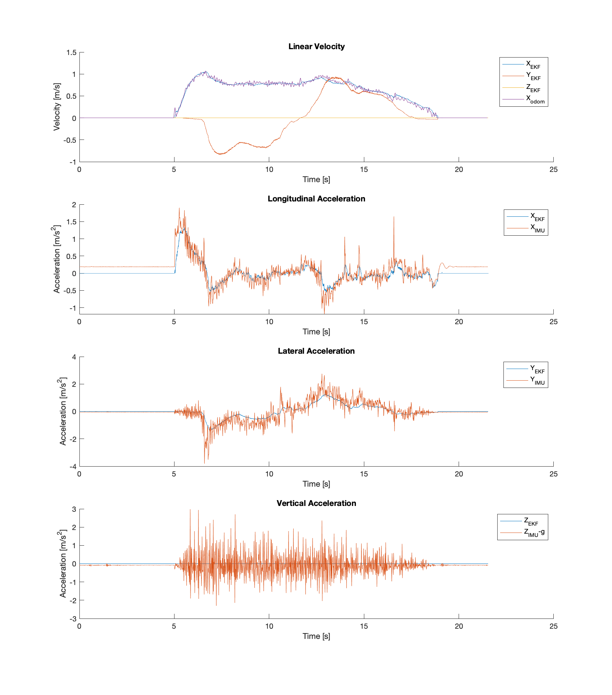
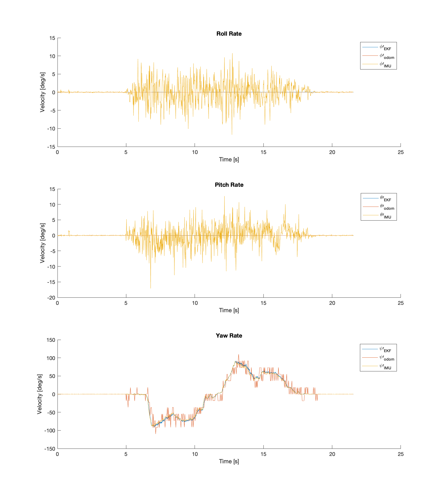

# Six D Rates Example

This shows how to use the state estimation library for a velocity estimation problem using the 6D rates state definition and models. This filter is operating on odometry and IMU measurements from an RC instrumented with a Phidgets Spatial 3/3/3 IMU and wheel encoders.

The script shows how to construct the filter, the system and measurement models, define process and measurement covariances, setup transformations between sensor frames, define stationary criteria, and specify what states to estimate.

The script takes in CSV files with the odometry and IMU measurements and writes the full filter state to an output CSV file.

To execute the example run the following command from this directory:
```
../build/six_d_rates_example data/odom_data.txt data/imu_data.txt data/filter_data.txt
```

There is a Matlab/Octave script for plotting the results which will produce plots like below:



The sample data files were generated from rosbags with the following commands:
```bash
rostopic echo -b dataset.bag --noarr -p /odom > odom_data.txt
rostopic echo -b dataset.bag --noarr -p /imu/data > imu_data.txt
```
